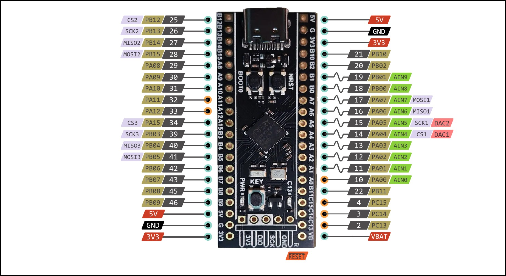

.. _blackpill_f403acg:

WeAct Studio Black Pill Core
############################

Overview
********

The WeAct Black Pill Core Board is an extremely low cost and bare-bones
development board featuring the AT32F403ACGU7, see `AT32F403ACGU7 website`_.
This is the 48-pin variant of the AT32F403Ax series,
see `AT32F403Ax reference manual`_. More info about the board available
`here <at32-base-board-page_>`_ and on `WeAct Github`_.

.. image:: img/blackpill-core.png
      :align: center
      :alt: Black Pill Core

Hardware
********

The AT32F403ACG based Black Pill Core Board provides the following
hardware components:

- AT32F403ACGU7 in UFQFPN48 package
- ARM |reg| 32-bit Cortex |reg| -M4 CPU with MPU
- Floating point unit
- 240 MHz max CPU frequency
- VDD from 2.6 V to 3.6 V
- 1024 KB Flash
- 96+128 KB SRAM
- GPIO with external interrupt capability
- 3x12-bit, 2 MSPS ADC with 10 input channels
- 14-channel DMA Controller
- Up to 16 Timers (eight 16-bit, two 32-bit, two watchdog timers and a SysTick timer)
- USART/UART (3+4)
- I2C (3)
- SPI/I2S (4/4)
- SDIO (2)
- USB 2.0 full-speed device/host/OTG controller with on-chip PHY
- CRC calculation unit
- 96-bit unique ID
- RTC

Supported Features
==================

The Zephyr blackpill_f403acg board configuration supports the following
hardware features:

+------------+------------+-------------------------------------+
| Interface  | Controller | Driver/Component                    |
+============+============+=====================================+
| NVIC       | on-chip    | nested vector interrupt controller  |
+------------+------------+-------------------------------------+
| SYSTICK    | on-chip    | system clock                        |
+------------+------------+-------------------------------------+
| UART       | on-chip    | serial port                         |
+------------+------------+-------------------------------------+
| GPIO       | on-chip    | gpio                                |
+------------+------------+-------------------------------------+
| FLASH      | on-chip    | flash                               |
+------------+------------+-------------------------------------+
| SPI        | on-chip    | spi                                 |
+------------+------------+-------------------------------------+
| I2C        | on-chip    | i2c                                 |
+------------+------------+-------------------------------------+
| ADC        | on-chip    | ADC Controller                      |
+------------+------------+-------------------------------------+
| USB OTG FS | on-chip    | USB device                          |
+------------+------------+-------------------------------------+

The default configuration can be found in the defconfig file:

        ``boards/arm/blackpill_f403acg/blackpill_f403acg_defconfig``

Pin Mapping
===========

Available pins:
---------------

Default Zephyr Peripheral Mapping:
----------------------------------

- UART_1 TX/RX : PA9/PA10
- I2C1 SCL/SDA : PB8/PB9
.. - SPIM CS/SCK/IO0/IO1/IO2/IO3 : PA8/PB1/PA11/PA12/PB7/PB6 (Routed to footprint for external flash)
.. - PWM_4_CH1 : PB6
.. - PWM_4_CH2 : PB7
.. - ADC_1 : PA1
- USER_PB : PA0
- USER_LED : PC13

Clock Sources
-------------

The board has two external oscillators. The frequency of the slow clock (LSE) is
32.768 kHz. The frequency of the main clock (HSE) is 8 MHz.

The default configuration sources the system clock from the PLL, which is
derived from HSE, and is set at 240MHz. The dedicated 48 MHz usb clock
is generated from the internal main PLL or direct from the 48 MHz HICK.

Programming and Debugging
*************************

There are 2 main entry points for flashing AT32F403Ax SoCs, one using the ROM
bootloader, and another by using the SWD debug port (which requires additional
hardware). Flashing using the ROM bootloader requires a special activation
pattern, which can be triggered by using the BOOT0 pin.

Flashing
========

Installing dfu-util
-------------------

It is recommended to use at least v0.8 of `dfu-util`_. The package available in
debian/ubuntu can be quite old, so you might have to build dfu-util from source.

There is also a Windows version which works, but you may have to install the
right USB drivers with a tool like `Zadig`_.

Flashing an Application
-----------------------
To power on the device, connect a USB-C cable and the board should power ON.
There are two methods to force the board in dfu mode:
* Method 1: When the power is on, press the BOOT0 key and the reset key, then release the reset key, and release the BOOT0 key after 0.5 seconds
* Method 2: When the power is off, hold down the BOOT0 key, and release the BOOT0 at 0.5s after the power is on

The dfu-util runner is supported on this board and so a sample can be built and
tested easily.

.. zephyr-app-commands::
   :zephyr-app: samples/basic/blinky
   :board: blackpill_f403acg
   :goals: build flash

Debugging
=========

The board can be debugged by installing the included 100 mil (0.1 inch) header,
and attaching an SWD debugger to the 3V3 (3.3V), GND, SCK, and DIO
pins on that header.

References
**********

.. target-notes::

.. _board release notes:
   https://github.com/WeActStudio/WeActStudio.MiniSTM32F4x1/blob/master/HDK/README.md

.. _Zadig:
   https://zadig.akeo.ie/

.. _WeAct Github:
   https://github.com/WeActStudio/WeActStudio.MiniSTM32F4x1

.. _stm32-base-board-page:
   https://stm32-base.org/boards/STM32F401CCU6-WeAct-Black-Pill-V1.2.html

.. _dfu-util:
   http://dfu-util.sourceforge.net/build.html

.. _STM32F401CC website:
   http://www.st.com/en/microcontrollers/stm32f401cc.html

.. _STM32F401x reference manual:
   http://www.st.com/resource/en/reference_manual/dm00096844.pdf
